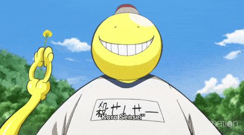

# Assassination API

  

Take advantage of what you have, while you have it.

## Quotes from Assassination Classroom

  

Assassination classroom is one of best anime with a lot of life lessons. This is API to get random quotes from this anime. Made using Flask.

## Guide

  

- Get random quote `/api/random`
- Get 5 random quotes `/api/quotes`
- Get available characters name `/api/characters`
- Get quotes of particular character `/api/characters/<character name>` (name is case sensitive)

## Contribution

Just make a PR to add some more quotes in `quotes.json` or any improvement you would like to see in the code.

  

